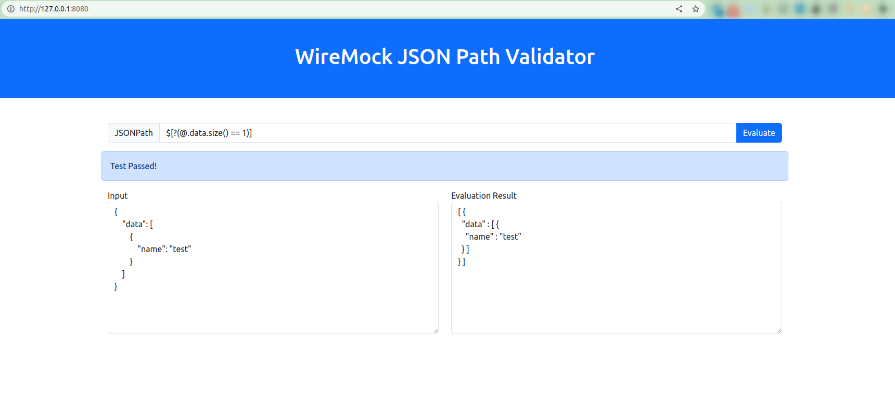

# wiremock-utility

you can use this to validate JSONPaths for wire mock. Because many JSONPath validators on the internet not support wiremock syntax's.  

## Run
you can run this from docker.

```shell
docker-compose up
```
or

for new docker compose version
```shell
docker compose up
```

By default this will run on 8080 port, you can change it from docker-compose.yml file.

## Let's use

Goto http://127.0.0.1:8080/


